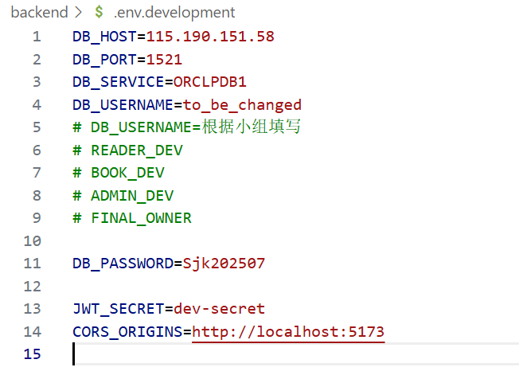

## 图书馆管理系统

### 0.准备阶段
- 技术栈vue3(js) + C# + Oracle 19c
- vue3自学网站 https://cn.vuejs.org/guide/quick-start
- C#自学网站 https://learn.microsoft.com/zh-cn/dotnet/csharp/


### 1.运行方法
#### 1.环境配置

- 需要Node.js 22.14.0 

    下载地址 https://nodejs.org/zh-cn

    检验，输出版本则正确
    ```
    node -v
    npm -v
    ```
 - 下载并锁定依赖
    ```
    npm install
    ```
 - .net8.0
    下载地址
    https://dotnet.microsoft.com/en-us/download/dotnet/8.0
    
    Windows → Installers → x64下载并运行exe

-  更换环境变量/books_management_system/backend/.env.development

   

#### 2.开发环境启动方式 前端后端都运行在本地+数据库运行在远程服务器（大家在window上这样启动）

- 前端
```
cd frontend
npm run dev    # 自动读取 .env.development
```

- 后端
```
cd backend
export ASPNETCORE_ENVIRONMENT=Development
dotnet watch run
```

- 数据库代码运行方式

方案一 (图形化，推荐)拖拽到sql develop运行，sql develop连接到远程服务器运行代码

方案二 (命令行)vscode远程连接服务器控制台运行sql代码

#### 3.部署后服务器上启动方式
- 前端
```
cd frontend
npm run build     # 读取 .env.production
```